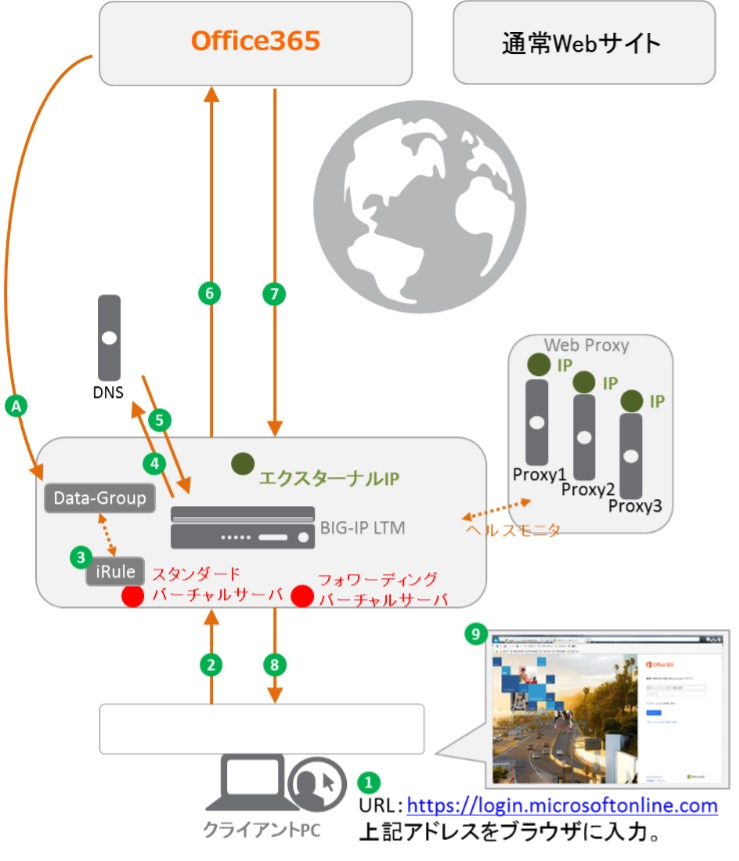
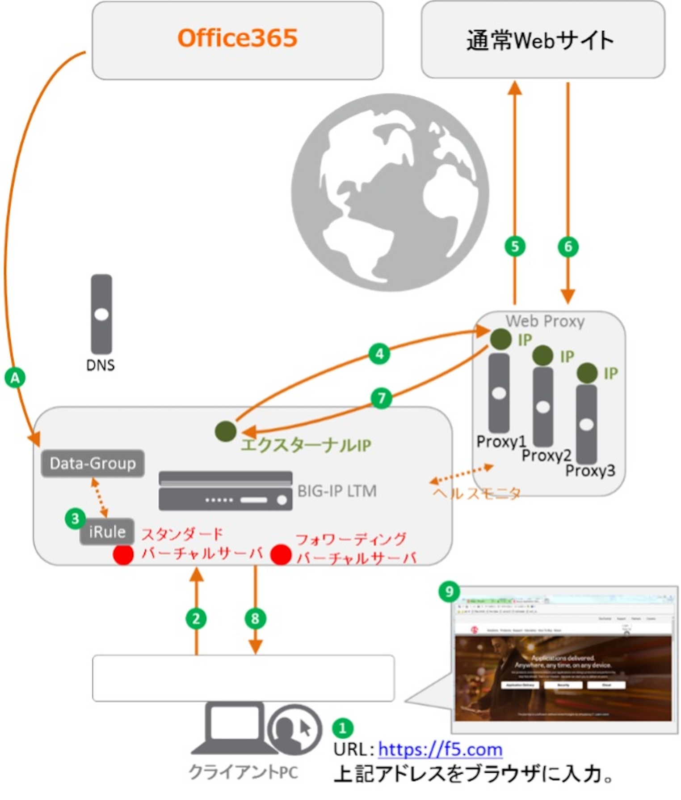

1.1 動作概要
======================================

本ソリューションは、以下のような流れで動作します。

1. O365宛通信 

※ 公開情報からO365関連アドレスをBIG-IPのData-Groupへ登録。

1. クライアントPCのWebブラウザに、URL：https://login.microsoftonline.comを入力
2. クライアントPCは、WebブラウザのProxy設定に従いBIG-IPへHTTPリクエストを送信
3. iRuleによりData-Groupと比較しO365関連アドレスか否かを判別し、O365関連アドレスであればBIG-IPをProxyとするiRuleコマンドを実施
4. login.microsoftonline.comのIPアドレスを解決するためにDNSクエリを送信
5. DNSサーバからlogin.microsoftonline.comのIPアドレスを得る
6. BIG-IPからO365宛にHTTPリクエストを送信
7. O365はHTTPリクエストに対するHTTPレスポンスを送信
8. HTTPレスポンスを受け取ったBIG-IPはHTTPレスポンスをクライアントPCへ転送
9. login.microsoftonline.comのWeb画面が表示される

2. 通常Webサイト宛通信

※ 公開情報からO365関連アドレスをBIG-IPのData-Groupへ登録

1. クライアントがWebブラウザに、URL：https://f5.comを入力。
2. クライアントPCは、WebブラウザのProxy設定に従いBIG-IPへHTTPリクエストを送信
3. iRuleによりData-Groupと比較しO365関連アドレスか否かを判別し、O365関連アドレスに含まれていなければiRuleコマンドによりWeb Proxyが含まれたPoolを選定
4. 選定されたPoolの中から1台を選定し、Web Proxy宛に通信を転送
5. Web ProxyからO365宛にHTTPリクエストを送信
6. O365はHTTPリクエストに対するHTTPレスポンスを送信
7. HTTPレスポンスを受け取ったWeb ProxyはHTTPレスポンスをBIG-IPへ転送
8. BIG-IPはクライアントPCへそれを転送
9. f5.comのWeb画面が表示される

