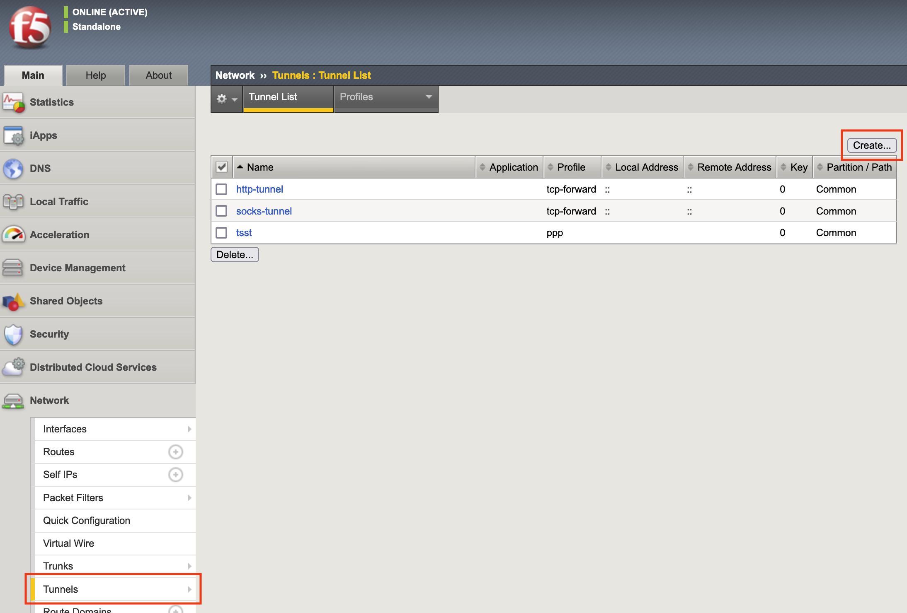
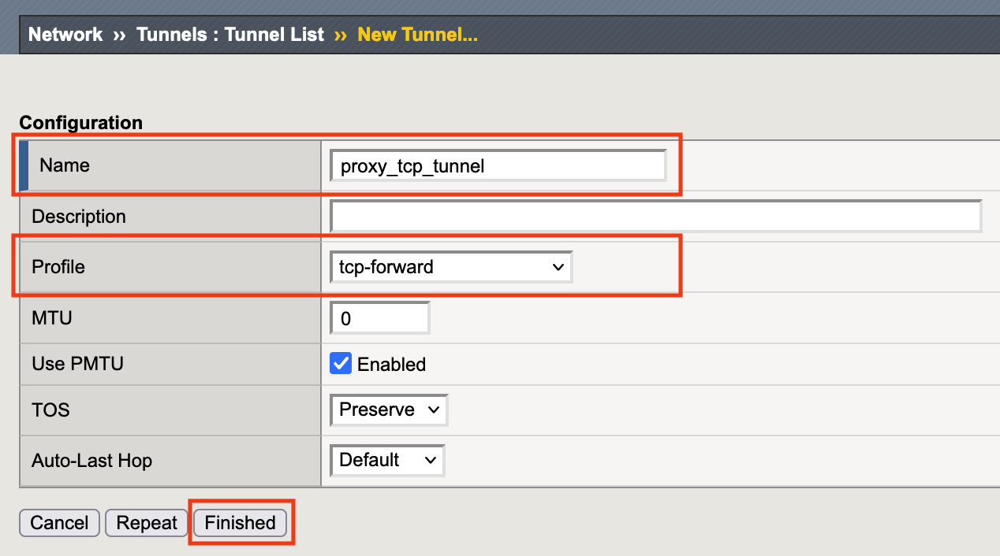

1.4 Tunnelsの作成
======================================

1. 「Network」 → 「Tunnels」 → 「Tunnel List」で表示された画面の右上にある\ ``Create``\ をクリックします。

2. 任意の名前を入力し、「Profile」部分では「tcp-forward」を選択した後、\ ``Finished``\ をクリックします。

