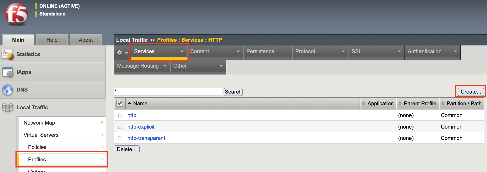
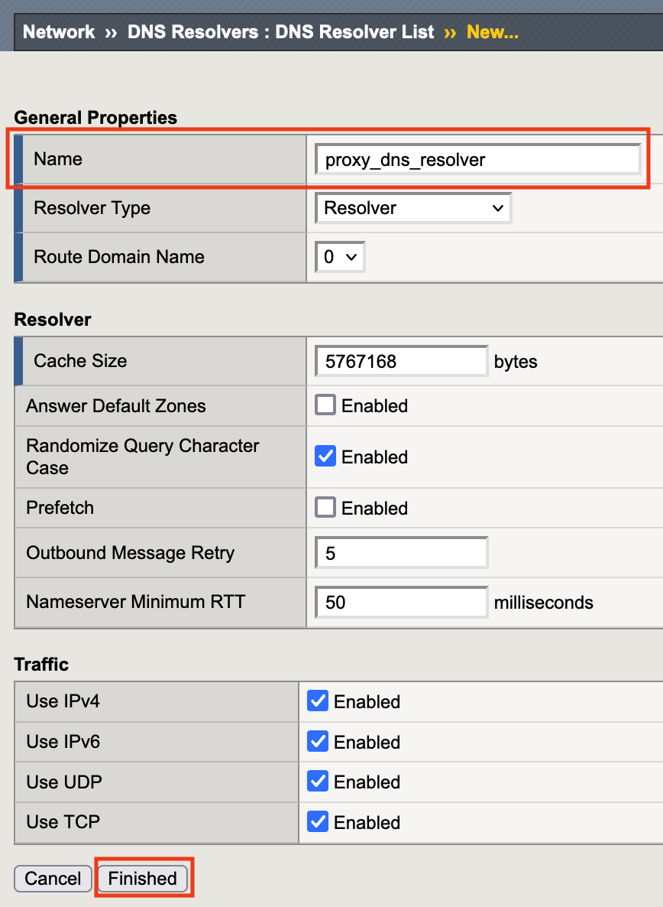

Explicit HTTP Profileの作成
======================================

1. 「Local Traffic」→「Profiles」→「Services」→「HTTP」で表示された画面の右上にある「Create」ボタンをクリックします。

2. 必要内容を入力し、「DNS Resolver」の横のボックスへチェックし、「＋」をクリックします。

.. figure:: images/Picture2.png
   :scale: 50%
   :align: center

3. 表示される画面にて内容を入力し、「Finished」をクリックします。

4. 「DNS Resolver」が入力されていることを確認し、「Tunnel Name」にて作成したTunnelを選択した後、「Finished」をクリックします。

.. figure:: images/Picture4.png
   :scale: 50%
   :align: center

