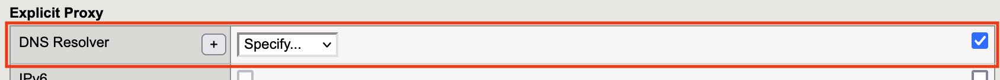
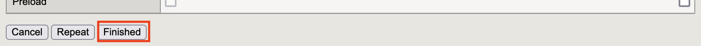

1.5 Explicit HTTP Profileの作成
======================================

1. 「Local Traffic」→「Profiles」→「Services」→「HTTP」で表示された画面の右上にある\ ``Create``\ をクリックします。

2. 必要内容を入力し、「DNS Resolver」の一番右のボックスへチェックし、\ ``+``\ をクリックします。

3. 赤枠の内容を入力し、\ ``Finished``\ をクリックします。

4. 作成した「DNS Resolver」が入力されていることを確認し、「Tunnel Name」にて作成したTunnelを選択した後、\ ``Finished``\ をクリックします。

