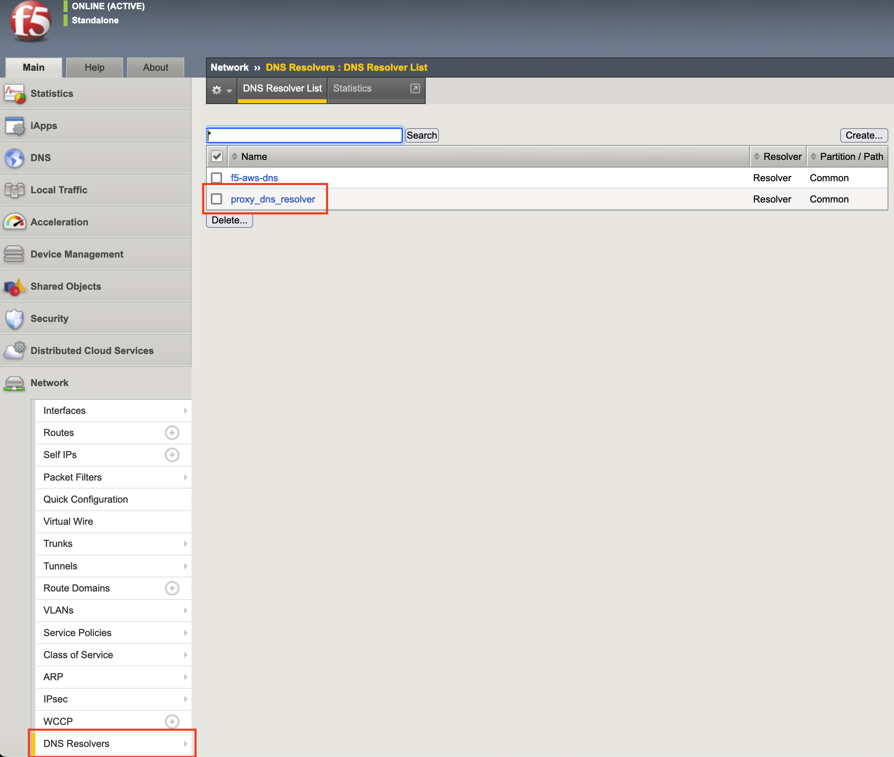
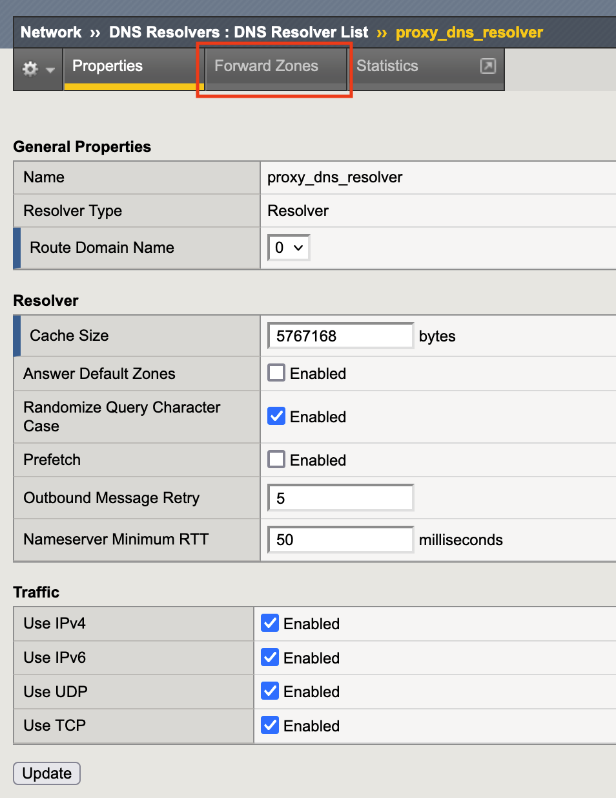
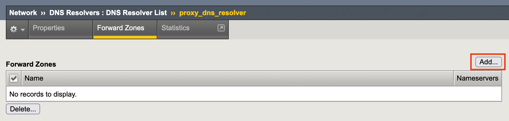
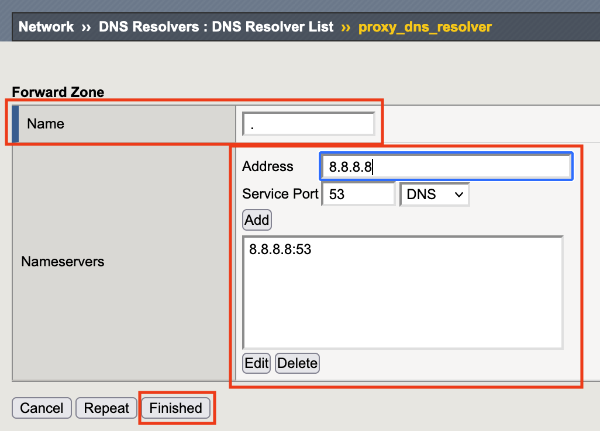

1.6 DNS Resolverの設定
======================================

1. 「Network」→「DNS Resolvers」で表示された画面内にある前項で作成したDNS Resolverをクリックします。

2. 「Forward Zones」タブをクリックします。

3. \ ``Add...``\ をクリックします。

4. 「Name」へ任意のドメイン名をFQDN形式で入力し、「Address」へ利用するDNSのIPを入力し、\ ``Add``\ をクリックします。

   その後、\ ``Finished``\ をクリックします。

   ※本書では指定が無いため「Name」部分を\ ``.``\ （ドット）と指定しています。

