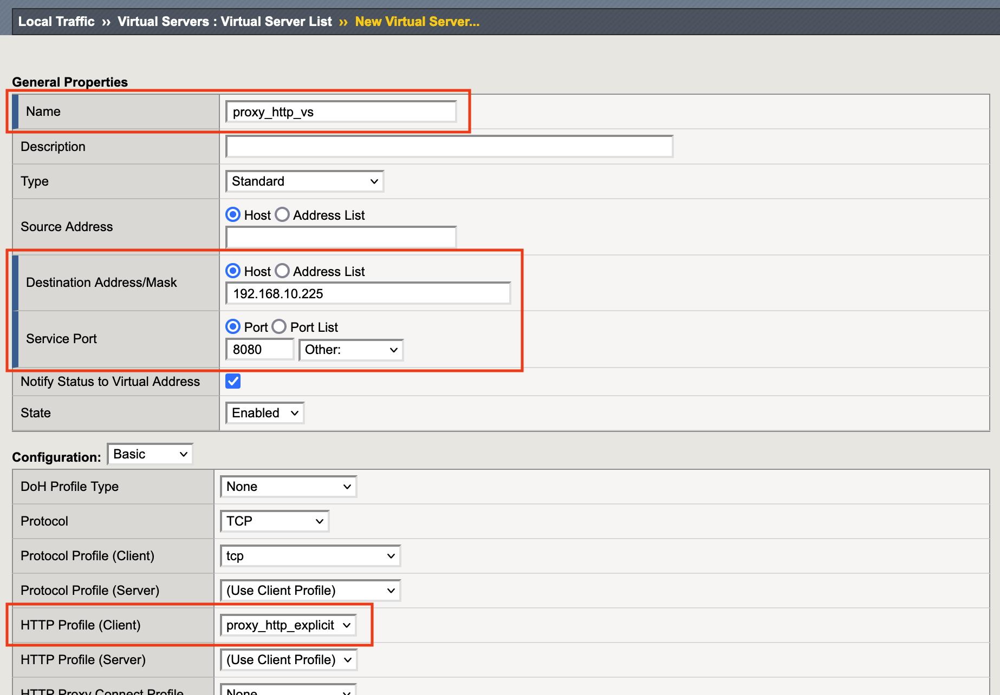

1.7 HTTP Forward Proxy Virtualの作成
======================================

1. 「Local Traffic」→「Virtual Servers」で表示された画面の右上にある\ ``Create``\ を押します。

.. figure:: images/Picture1.png
   :scale: 50%
   :align: center

2. 下記内容を参考に入力し、\ ``Finished``\ を押します。

.. figure:: images/Picture2-2.png
   :scale: 50%
   :align: center

