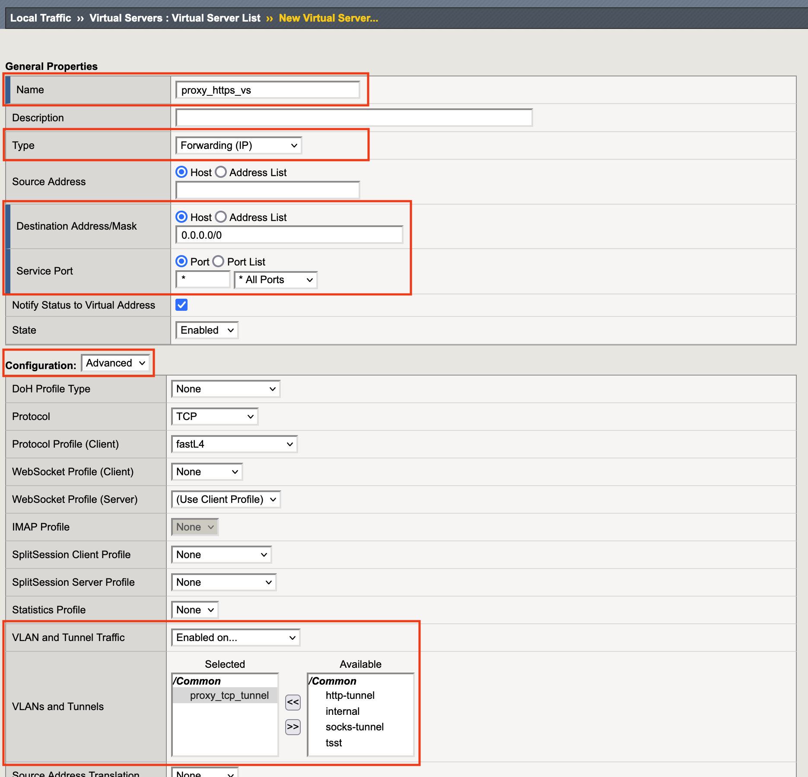

1.8 HTTPS Forward Proxy Virtualの作成
======================================

1. 「Local Traffic」→「Virtual Servers」で表示された画面の右上にある\ ``Create``\ をクリックします。

2. 図の様に入力し、\ ``finished``\ をクリックします。

3. ここまで設定すると下図の状態となります。

