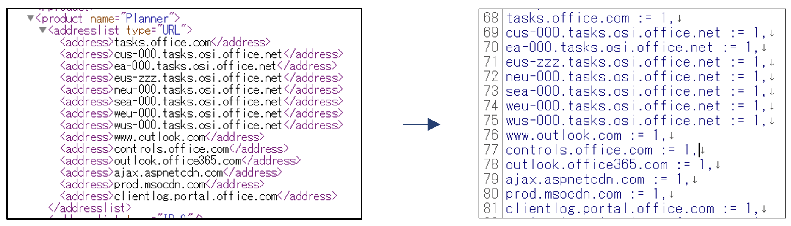
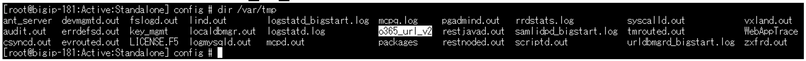

1.9.1 External Data-Group用ファイルの作成
======================================

1. BIG-IPのHost側(Linux側)に、Data-Group用の外部ファイルを保存
~~~~~~~~

    事前にエディタ等を用いて公開されているアドレスをBIG-IPで利用可能な形に整形しておきます。

.. NOTE::
   公開情報はいくつか注意点に伴い登録情報の作成と運用方針の決定が必要となります。

   ・大文字だがアクセスは小文字などの差分修正

   ・「equivioprod*.cloudapp.net」などの文字列内に「*」がある場合の登録方針

   ・公開情報への反映前に発生する実アクセス先に対する方針

   例) 2016/7/4時点はSkypeに関する公開情報では以下のアクセス先が登録されていないが実アクセスあり

    a.config.skype.com

    swx.cdn.skype.com

   2016/7/23時点はSkypeに関する公開情報へ登録されている
----

   この様な例があるためマッチング対象の選定は事前確認をお願い致します。

<アドレスサンプル>

   ファイルを保存するディレクトリはどこでも問題ありませんが、本書では、/var/tmp ディレクトリに保存します。

また、本書ではファイル名「o365_url_v2」として保存しています。

2. 作成した外部ファイルの読み込み
~~~~~~~~

tmshで 以下のコマンドで、外部ファイルをオブジェクトとして読み込みます。

.. code-block:: cmdin

   (tmos)# create sys file data-group ext_o365_url_object type string source-path file:/var/tmp/o365_url_v2

   Copying file "file:/var/tmp/o365_url_v2" ...

     % Total    % Received % Xferd  Average Speed  Time　Time 　Time	Current

                                    Dload  Upload  Total　Spent   Left	Speed

   100  8701  100  8701   0    0  12.0M      0　　--:--:--　--:--:--　--:--:--     0

3. External Data-Groupを作成するため「Local Traffic」→「iRules」→「Data Group List」を選択し、右に表示される「Create」ボタンをクリックします。
~~~~~~~~

.. figure:: images/Picture3.png
   :scale: 50%
   :align: center

4. 任意の名前を入力し、Typeを「External File」、File Nameを「ext_o365_url_object」として「Finished」ボタンを押します。
~~~~~~~~

.. figure:: images/Picture4.png
   :scale: 50%
   :align: center

5. 「Local Traffic」→「iRules」→「iRules List」で表示された画面の右上にある「Create」ボタンを押します。
~~~~~~~~

.. figure:: images/Picture5.png
   :scale: 50%
   :align: center

6. 下記iRuleを参考にし、「Finished」ボタンを押します。
~~~~~~~~

.. figure:: images/Picture6.png
   :scale: 50%
   :align: center

.. code-block:: cmdin

when HTTP_PROXY_REQUEST {					#Proxyリクエスを受け取ったときイベント発生

   log local0. "[HTTP::method] [HTTP::host] [HTTP::uri]"		#ログ出力

   if { [class match [HTTP::host] contains ext_o365_url] } {		#HOSTヘッダとExternal Data-Groupをマッチング

      HTTP::proxy enable						#HTTP Proxyを有効化

      log local0. "* BIGIP *"					#* BIGIP *ログ出力

   } else {

      HTTP::proxy disable						#HTTP Proxyを無効化

      log local0. "* Web Proxy *"					#* Web Proxy *ログ出力

      pool webproxy_pool						#Poolを指定

   }

}

