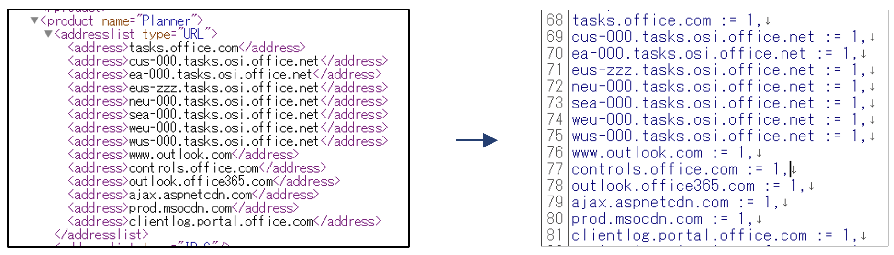
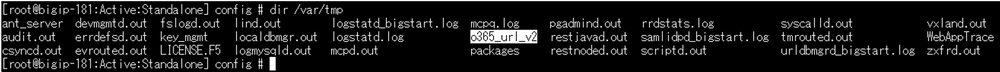
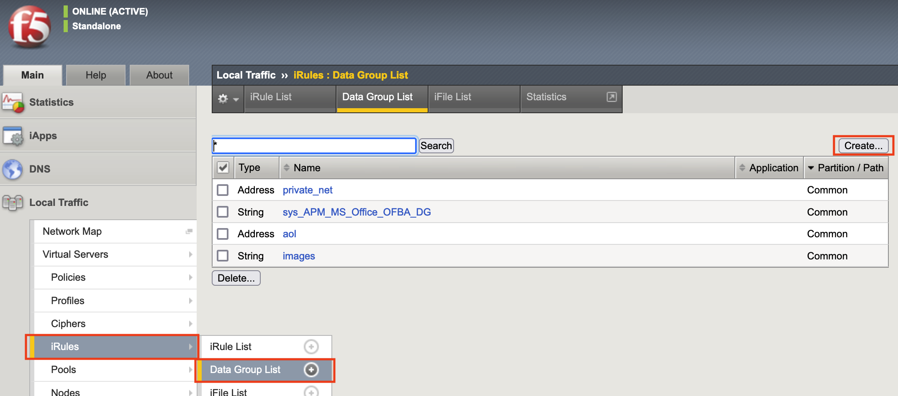
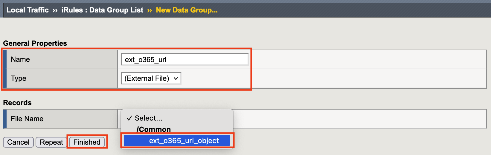
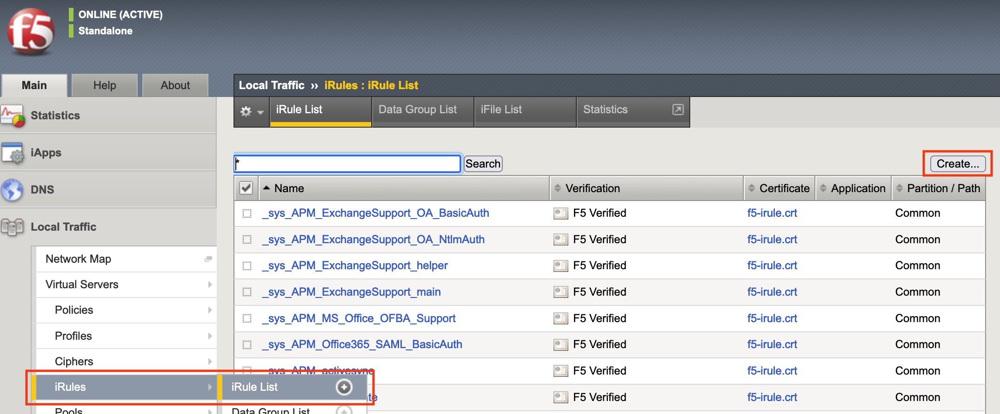
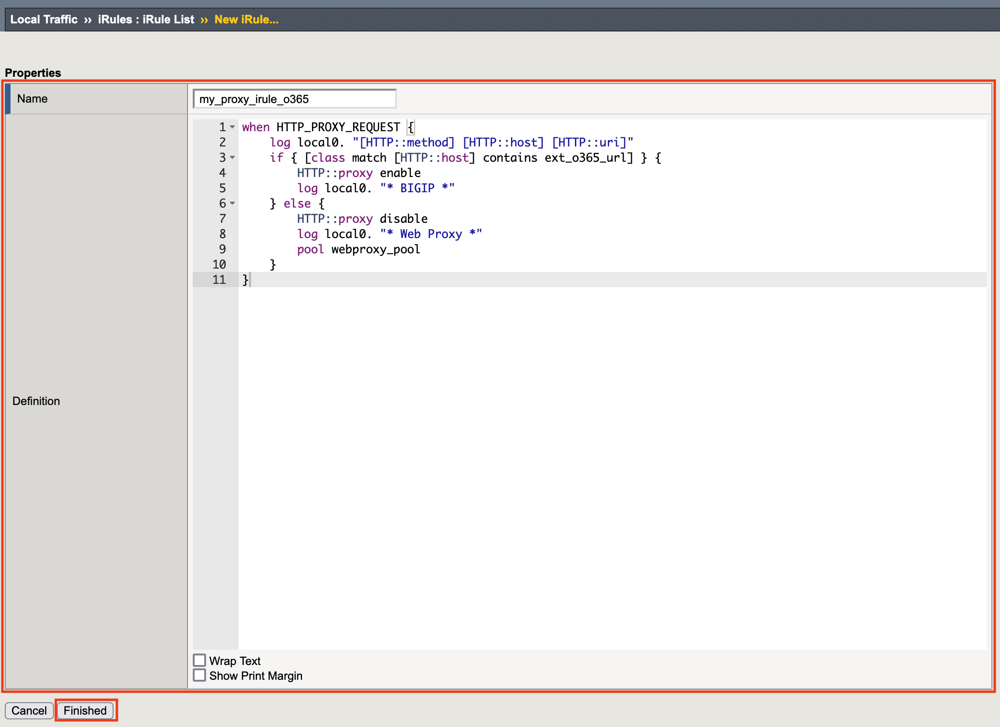
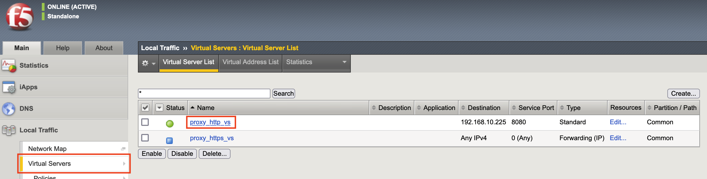
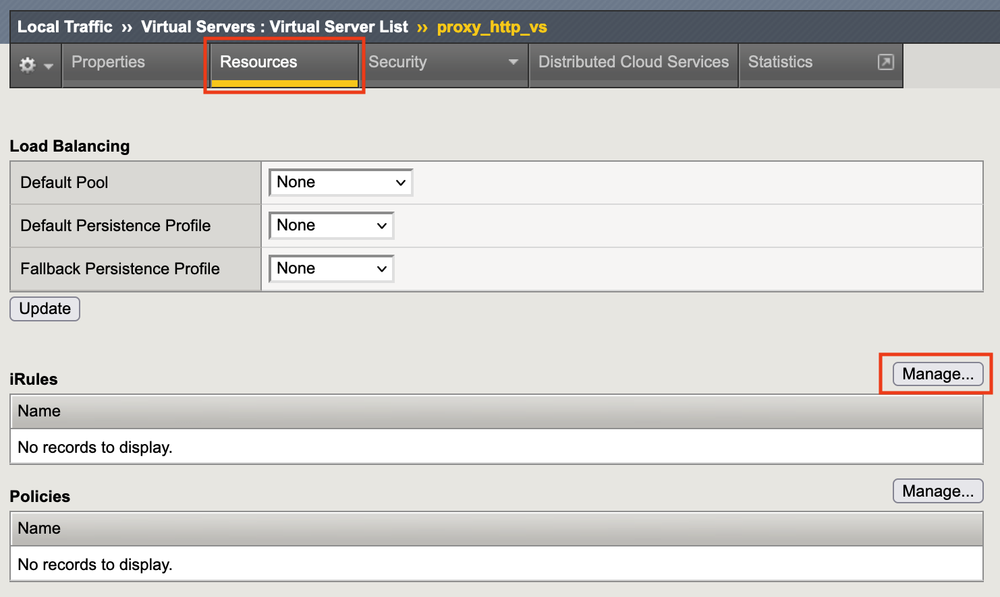
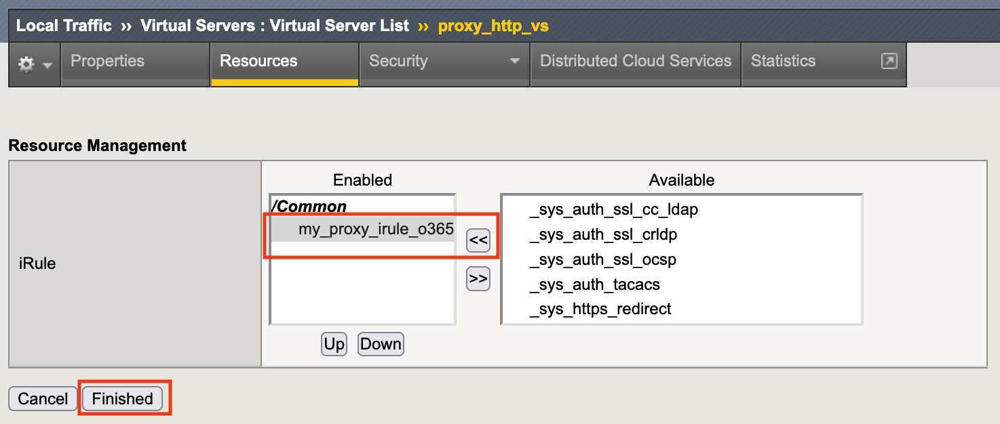
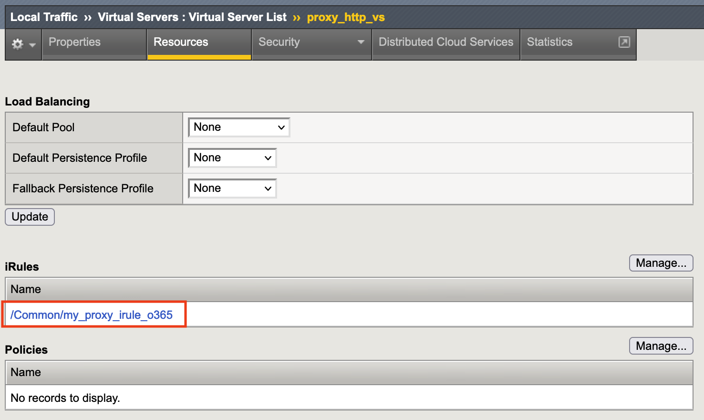

1.9 Office365判別用iRuleの作成とVSへの割り当て
======================================

本項ではMicrosoft社にて公開されている情報を元にOffice365の関連アドレスをExternal Data-GroupでマッチングさせるiRuleを作成し、Virtual Serverへと適用します。

   インターネット上で公開されているものを本書では手動で取り込み、BIG-IP向けに加工・成型して取り込みを行っているため、公開もとの情報に関してはMicrosoft社へお問合せ願います。

.. NOTE::
  Office 365 の URL と IP アドレスの範囲（MicroSoft社ページ） (2023/12時点)

     https://learn.microsoft.com/ja-jp/microsoft-365/enterprise/urls-and-ip-address-ranges

   ※ XMLは2018/10/2で終了
----

   なお、iCallにより手動取り込みではなく、スケジュールベースでの自動取り込みにもBIG-IPは対応可能です。

   iRuleやExternal Data-Groupの利用について詳細は「iRulesかんたんセットアップガイド」をご参照下さい。

1. External Data-Group用ファイルの作成

   BIG-IPのHost側(Linux側)に、Data-Group用の外部ファイルを保存します。

   事前にエディタ等を用いて公開されているアドレスをBIG-IPで利用可能な形に整形しておきます。

.. NOTE::
   公開情報はいくつか注意点に伴い登録情報の作成と運用方針の決定が必要となります。

   ・大文字だがアクセスは小文字などの差分修正

   ・「equivioprod*.cloudapp.net」などの文字列内に「*」がある場合の登録方針

   ・公開情報への反映前に発生する実アクセス先に対する方針

   例) 2016/7/4時点はSkypeに関する公開情報では以下のアクセス先が登録されていないが実アクセスあり

    a.config.skype.com

    swx.cdn.skype.com

   2016/7/23時点はSkypeに関する公開情報へ登録されている
----

   この様な例があるためマッチング対象の選定は事前確認をお願い致します。

<アドレスサンプル>

   ファイルを保存するディレクトリはどこでも問題ありませんが、本書では、/var/tmp ディレクトリに保存します。

また、本書ではファイル名「o365_url_v2」として保存しています。

2. 作成した外部ファイルの読み込み
~~~~~~~~

tmshで 以下のコマンドで、外部ファイルをオブジェクトとして読み込みます。

.. code-block:: cmdin

   (tmos)# create sys file data-group ext_o365_url_object type string source-path file:/var/tmp/o365_url_v2

   Copying file "file:/var/tmp/o365_url_v2" ...

     % Total    % Received % Xferd  Average Speed  Time　Time 　Time	Current

                                    Dload  Upload  Total　Spent   Left	Speed

   100  8701  100  8701   0    0  12.0M      0　　--:--:--　--:--:--　--:--:--     0

3. External Data-Groupを作成するため「Local Traffic」→「iRules」→「Data Group List」を選択し、右に表示される「Create」ボタンをクリックします。
~~~~~~~~

4. 任意の名前を入力し、Typeを「External File」、File Nameを「ext_o365_url_object」として「Finished」ボタンを押します。
~~~~~~~~

5. 「Local Traffic」→「iRules」→「iRules List」で表示された画面の右上にある「Create」ボタンを押します。
~~~~~~~~

6. 下記iRuleを参考にし、「Finished」ボタンを押します。
~~~~~~~~

.. code-block:: cmdin

when HTTP_PROXY_REQUEST {					#Proxyリクエスを受け取ったときイベント発生

   log local0. "[HTTP::method] [HTTP::host] [HTTP::uri]"		#ログ出力

   if { [class match [HTTP::host] contains ext_o365_url] } {		#HOSTヘッダとExternal Data-Groupをマッチング

      HTTP::proxy enable						#HTTP Proxyを有効化

      log local0. "* BIGIP *"					#* BIGIP *ログ出力

   } else {

      HTTP::proxy disable						#HTTP Proxyを無効化

      log local0. "* Web Proxy *"					#* Web Proxy *ログ出力

      pool webproxy_pool						#Poolを指定

   }

}

.. NOTE::
   Office365関連のテナント制限に関する機能を利用時はvirtual Server [proxy_https_vs] 側でHTTP headerの追加が必要。

   その際はVirtual ServerのTypeをStandardに変更するなどSSLを復号、再暗号化するための追加設定が必要となります。

   また、別途SSL Forward Proxyライセンスも必要となります。

   マッチング対象となるHTTPホストヘッダはMicrosoft社へご確認下さい。

   <テナント制限向けサンプル>

   .. code-block:: cmdin

switch [HTTP::host] {							#下記に列挙されるHTTPホストヘッダを比較
   "login.microsoftonline.com" {
      HTTP::header insert "Restrict-Access-To-Tenants" "固有ドメイン" }	#HTTPヘッダを挿入

      HTTP::header insert "Restrict-Access-Context" "AzureAD ID" }	#HTTPヘッダを挿入

   "login.microsoft.com" {

      HTTP::header insert "Restrict-Access-To-Tenants" "固有ドメイン" } 	#HTTPヘッダを挿入

      HTTP::header insert "Restrict-Access-Context" "AzureAD ID" }	#HTTPヘッダを挿入

   "login.windows.net" {

      HTTP::header insert "Restrict-Access-To-Tenants" "固有ドメイン" } 	#HTTPヘッダを挿入

      HTTP::header insert "Restrict-Access-Context" "AzureAD ID" }	#HTTPヘッダを挿入

　}

※ ログ出力の部分は動作確認終了後に削除を忘れないよう注意するか、HighSpeedLogging等の負荷を考慮したログ設計を実装願います。

7. 「Local Traffic」→「Virtual Servers」で表示された画面の右上にある「proxy_http_vs」をクリックします。
~~~~~~~~

8. 「Resources」タブをクリックし、「iRules」の横の「Manage」ボタンを押します。
~~~~~~~~

9. 作成したiRuleを割り当てて「Finished」ボタンを押します。
~~~~~~~~

10. iRuleが割り当たったことを確認しBIG-IP側の作業を終了します
~~~~~~~~

