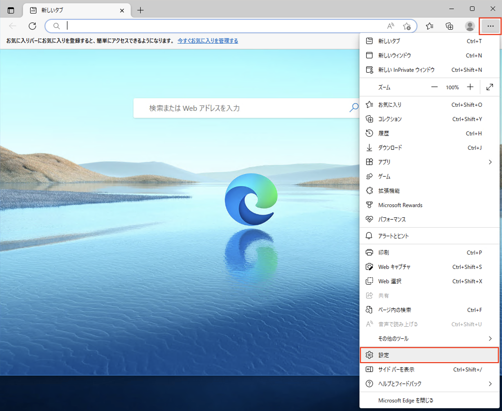
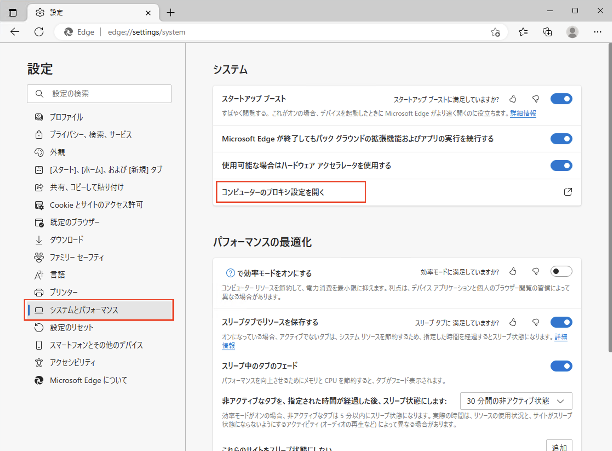
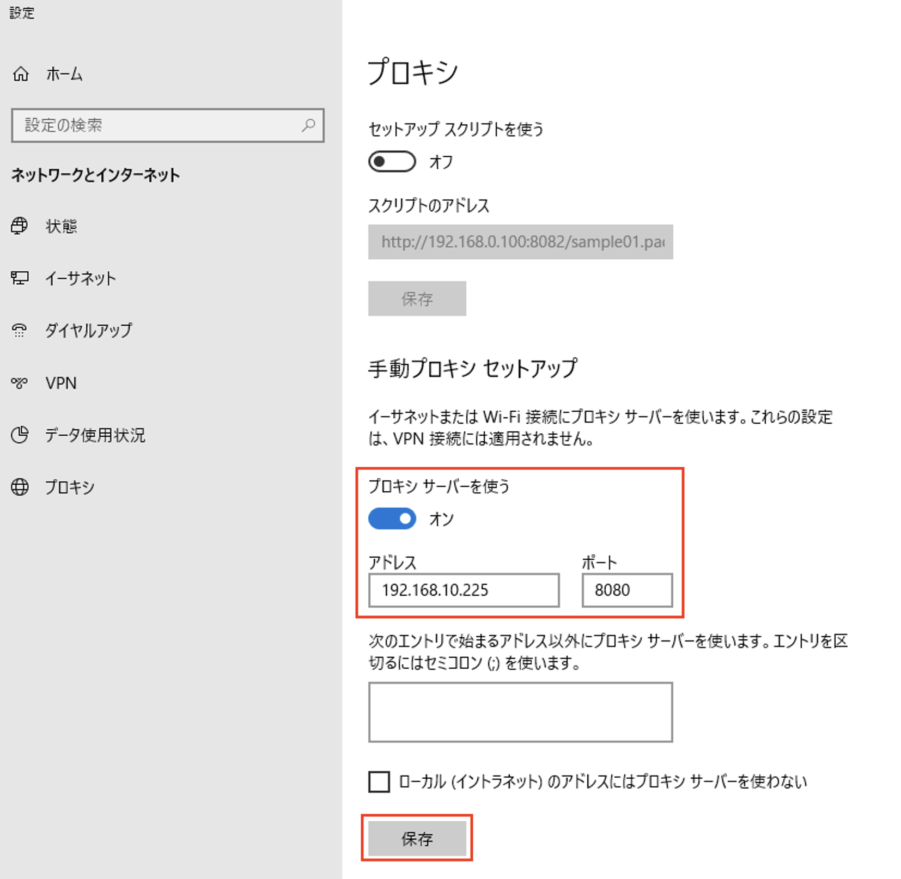

1.10 疎通確認(windows PC)
======================================

クライアントPCからBIG-IPが正常に振り分けができているかを確認します。

1. クライアントPCでMicrosoft Edgeを起動し、\ ``・・・``\から、\ ``設定``\をクリックします。 

2. システムとパフォーマンスから\ ``コンピュータのプロキシ設定を開く``\をクリックします。

3. 手動プロキシセットアップで\ ``プロキシサーバを使う``\を\ ``オン``\にし、アドレス、ポートを入力し、保存をクリックします。

以上で疎通確認の準備は終了です。

ブラウザでアクセスした後、BIG-IP上のログより動作を確認し、対象アドレス等を調整します。

