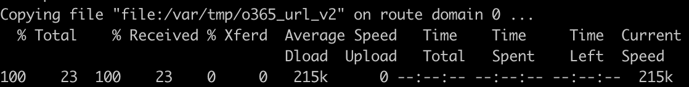

1.11 (参考) External Data-Groupの修正
=================

O365関連アドレスに変更があった際はBIG-IPに取り込んでいる情報も変更する必要があります。
External Data-Groupの外部ファイル、本書における「o365_url_v2」を編集後に再度/var/tmpに配置した後以降の手順を実施します。

(1)	修正後の外部ファイルをExternal Data-Groupへ反映
tmshで 以下のコマンドを実行することで、Data-Groupへ反映できます。

.. code-block:: cmdin

   (tmos)# modify sys file data-group ext_o365_url_object source-path file:/var/tmp/ o365_url_v2

(2)	更新を以下コマンドで確認します。
“last-update-time“ が更新されていることを確認します。

.. code-block:: cmdin

   (tmos)# list sys file data-group ext_o365_url_object

.. figure:: images/Picture2.png
   :scale: 50%
   :align: center

